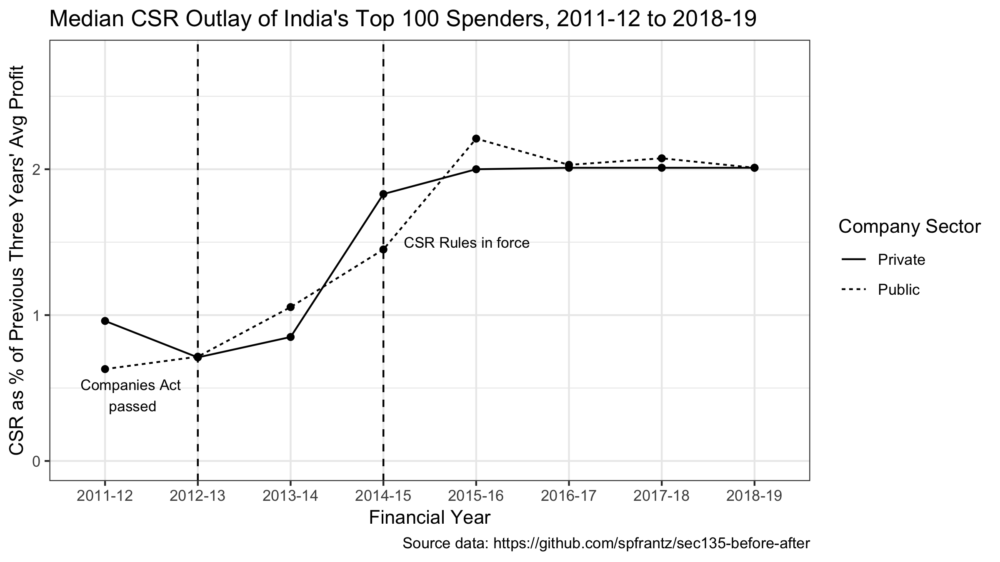

# Indian CSR Spending Before and After Section 135



## Description

Section 135 of India's Companies Act (2013) requires companies that meet certain thresholds of revenue, profit, or market capitalization to spend two percent of their profits on corporate social responsibility (CSR). Specifically, they must spend two percent of the average before-tax profit of the preceding three fiscal years on a list of thematic areas enumerated in Schedule VII of the Act. My working paper "CSR from the Top-Down: Six Years of Mandatory Corporate Social Responsibility in India," included in this repository, contains much more detail on the mandate and its consequences.

CSR expenditure data from fiscal year 2014-15 -- the first year the spending mandate was in force -- and onwards is part of companies' audited financial statements and is available from commercial datasets such as ProwessDx. Data from prior to this period has not been available in a regular format.

To obtain data from before 2014-15, I reviewed three years of narrative annual reports and sustainability reports of the 100 largest spenders under Section 135. Data for a majority of companies is available in all years except 2011-12, for which data from 48 firms is available. Using data from ProwessDx, I have also calculated figures for CSR spending as a percentage of the previous three years' average before-tax profits.

The data demonstrates that, by the second year of the spending mandate, the community development outlay of the median large spender had nearly tripled, from 0.7 percent of profits to 2 percent of profits. This was true for both private-sector and public-sector (government) firms. Spending figures for both sets of firms converged to nearly exactly two percent, demonstrating the importance of Section 135 in influencing company outlays. This likely understates the true effects of the mandate, since top-ranked spenders were more likely to report spending figures prior to 2014-15.

Full spending and profit data is available as follows:
* 2011-12: 48 companies
* 2012-13: 58 companies
* 2013-14: 61 companies
* 2014-15: 80 companies
* 2015-16: 95 companies
* 2016-17: 98 companies
* 2017-18: 97 companies
* 2018-19: 97 companies

## Files in this Repository
This repository contains the following files:

* `csr_before.csv`: A ranked list of the top aggregate CSR spenders under Article 135 (from 2014-15 through 2017-18), with spending data for the three years prior to the beginning of the mandate in 2014-15;  
* `data_notes.md`: Contains source information and other notes for `csr_before.csv`;
* `01_data_cleaning.R`: R script that takes three input files (two ProwessDx exports and the CSR spending data I collected), merges them, calculates CSR spending as a percentage of average three-year before-tax profit, and generates `csr_data_full.csv`. ProwessDx data is proprietary but I hope to make the input and output files available under fair use principles, pending advice from the GWU library;
* `csr_data_public.csv`: Full data on CSR expenditure for 2011-12 through 2018-19 as a percentage of 3-year average profits for top 100 spenders. This is `csr_data_full.csv` with ProwessDx proprietary data removed;
* `Frantz 2020 draft - Six Years of Section 135.pdf`: Draft working paper on the origins and consequences of Section 135;
* `spending_pub_priv.png`: The image you see above: median CSR spending as a percentage of average profits, for companies for which data is available.


## Variables in `csr_before.csv`

The following variables are in `csr_before.csv`:
* `company_name`: Legal name of the company;
* `cin`: Company's Corporate Identification Number issued by the Ministry of Corporate Affairs;
* `csr_total_rank`: Rank of company in terms of aggregate spending under Article 135 from 2014-15 to 2017-18. Calculated from the ProwessDx dataset;
* `csr_2011_12`: Expenditure on community development activities in fiscal year 2011-12, in millions INR;
* `csr_2012_13`: Expenditure on community development activities in fiscal year 2012-13, in millions INR;
* `csr_2013_14`: Expenditure on community development activities in fiscal year 2013-14, in millions INR;
* `public`: Whether company is a central or state public sector unit (1) or private-sector company (0).

## Variables in `csr_data_public.csv`

The following variables are in `csr_data_public.csv`:
* `id`: Unique observation (row) id. An observation is a company-year;
* `company_name`: Legal name of the company;
* `cin`: Company's Corporate Identification Number issued by the Ministry of Corporate Affairs;
* `rank_csr`: Rank of company in terms of aggregate spending under Article 135 from 2014-15 to 2017-18. Calculated from the ProwessDx dataset;
* `public`: Whether company is a central or state public sector unit (1) or private-sector company (0);
* `year`: Fiscal year;
* `spending_pbt3_pct`: Section-135-qualifying CSR spending, as a percentage of the previous three years' average net profits. Only included for companies for which profit data is available for each of the three years.

## How to Cite

If you use this data in your work, I would appreciate the courtesy of a citation. Suggested citation:

```
Frantz, Samuel P. (2020). "CSR From the Top-Down: Six Years of Mandatory
Corporate Social Responsibility in India." Draft working paper. Available at:
https://github.com/spfrantz/sec135-before-after.
```

## TODO

Additional planned work:
* Include data files from ProwessDx, if allowed under fair use principles;
* Exploratory data analysis.
